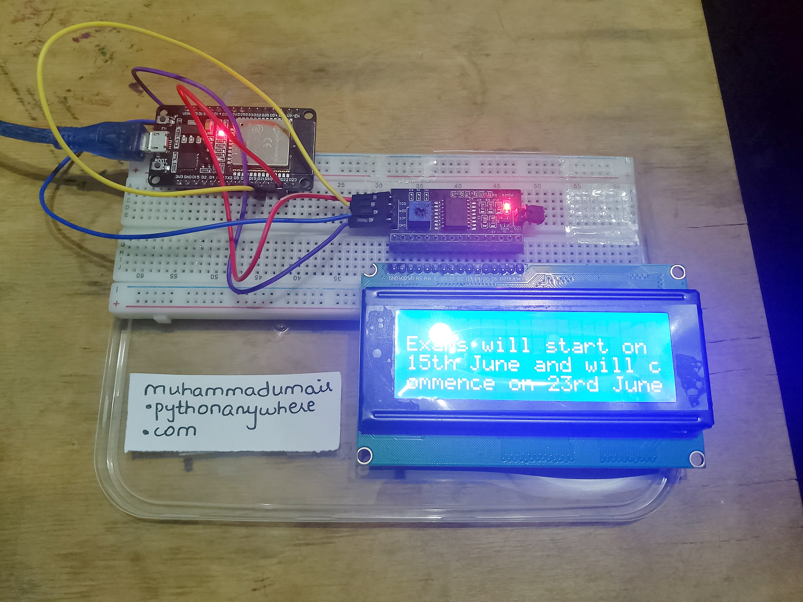
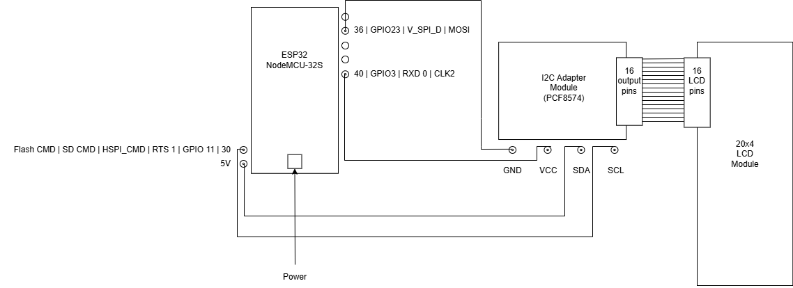

# NeoNotice

NeoNotice is a connected digital notice-board system for departments, institutions, and organizations.

It provides a web application for publishing and managing notices, together with an ESP32-based hardware display that retrieves active notices from the server and displays them on a 20×4 I2C LCD.



## Table of Contents

- [Overview](#overview)
- [Features](#features)
- [Technology Stack](#technology-stack)
- [Hardware](#hardware)
- [Project Structure](#project-structure)
- [How It Works](#how-it-works)
- [Local Web Application Setup](#local-web-application-setup)
  - [Prerequisites](#prerequisites)
  - [Clone the Repository](#1-clone-the-repository)
  - [Create a Virtual Environment](#2-create-a-virtual-environment)
  - [Install Python Dependencies](#3-install-python-dependencies)
  - [Apply Database Migrations](#4-apply-database-migrations)
  - [Install Frontend Dependencies](#5-install-frontend-dependencies)
  - [Build the Frontend](#6-build-the-frontend)
  - [Start the Django Server](#7-start-the-django-server)
- [Administrator Access](#administrator-access)
- [Frontend Development](#frontend-development)
- [ESP32 Setup](#esp32-setup)
  - [Hardware Requirements](#hardware-requirements)
  - [Wiring](#wiring)
  - [Upload the Firmware](#upload-the-firmware)
  - [Configure Wi-Fi and the Django Server](#configure-wi-fi-and-the-django-server)
- [API Endpoints](#api-endpoints)
- [ESP32 Response Format](#esp32-response-format)
- [Troubleshooting](#troubleshooting)
- [Production Considerations](#production-considerations)
- [Contributing](#contributing)
- [License](#license)

## Overview

NeoNotice consists of three connected parts:

1. A Django backend that stores users and notices.
2. A React frontend that provides the public notice board and administrator dashboard.
3. An ESP32 firmware application that retrieves active notices and displays them on an LCD.

Administrators can publish, update, and delete notices from the web dashboard. Visitors can view active notices on the public board, while the ESP32 hardware provides a physical display for the same information.

## Features

### Public notice board

- Displays active notices
- Shows the notice creator and publication date
- Automatically refreshes notice data
- Provides loading, empty, error, and retry states
- Provides access to the administrator login page

### Administrator dashboard

Administrators can:

- Log in through the web interface
- Create notices
- Edit existing notices
- Delete notices
- View the number of notices currently on the board
- Update their account credentials
- Log out securely

Notice content is limited to 100 characters by the backend data model and frontend dashboard.

### ESP32 notice display

The ESP32 firmware:

- Connects to Wi-Fi using WiFiManager
- Stores the Django server address using ESP32 Preferences
- Retrieves active notices over HTTPS
- Displays notices on a 20×4 I2C LCD
- Scrolls long notices across the display
- Refreshes notices periodically
- Cycles through notices automatically
- Provides a reset process for clearing Wi-Fi settings
- Runs a small health-check web server on the ESP32

## Technology Stack

### Web application

- **Backend:** Python and Django 5.2.4
- **Frontend:** React 19
- **Frontend tooling:** Vite
- **Database:** SQLite for local development
- **Styling:** CSS Modules and regular CSS

### ESP32 firmware

- **Microcontroller:** ESP32
- **Framework:** Arduino
- **Build system:** PlatformIO
- **Display:** 20×4 I2C LCD
- **Communication:** Wi-Fi and HTTPS

### Main libraries

- Django
- React
- React DOM
- Vite
- WiFiManager
- ArduinoJson
- LiquidCrystal_I2C

## Hardware

The hardware prototype uses an ESP32 development board connected to a 20×4 I2C LCD through a breadboard.

The setup includes:

- ESP32 development board
- 20×4 LCD module
- I2C LCD interface
- Breadboard
- Jumper wires
- USB power and programming connection

The LCD module uses I2C communication, allowing the ESP32 to control the display with only SDA and SCL signal connections in addition to power and ground.

## Project Structure

```text
NeoNotice/
├── Displaying_Notices/
│   ├── platformio.ini          # PlatformIO project configuration
│   └── src/
│       └── main.cpp            # ESP32 firmware and LCD display logic
│
├── e_noticeboard/
│   ├── settings.py             # Django project settings
│   ├── urls.py                 # Root URL configuration
│   ├── asgi.py                 # ASGI entry point
│   └── wsgi.py                 # WSGI entry point
│
├── frontend/
│   ├── package.json            # Frontend dependencies and scripts
│   ├── package-lock.json       # Locked npm dependency versions
│   ├── vite.config.js          # Vite build configuration
│   └── src/
│       ├── App.jsx             # Main React application controller
│       ├── main.jsx            # React entry point
│       ├── components/
│       │   ├── Board.jsx       # Public notice board
│       │   ├── Dashboard.jsx   # Administrator dashboard
│       │   ├── Login.jsx       # Administrator login
│       │   └── Notice.jsx      # Individual notice component
│       └── styles/              # CSS Modules and frontend styles
│
├── neo_notice/
│   ├── models.py               # User and Notice models
│   ├── views.py                # Authentication and notice endpoints
│   ├── urls.py                 # Application routes
│   ├── admin.py                # Django admin registrations
│   ├── migrations/             # Database migrations
│   ├── templates/               # Django template entry point
│   └── static/                  # Built frontend assets
│
├── manage.py                   # Django management utility
├── requirements.txt            # Python dependencies
└── .gitignore
```

## How It Works

The Django server acts as the central backend for the system.

1. The React frontend requests active notices from Django.
2. Django retrieves live notices from the database.
3. The public board displays those notices in the browser.
4. Administrators use the dashboard to manage notice content.
5. The ESP32 sends an HTTPS request to the notice endpoint.
6. Django returns active notice text as JSON.
7. The ESP32 parses the response and displays the notices on the LCD.

The React application provides three main views:

- Public notice board
- Administrator login
- Administrator dashboard

The application stores the current frontend session state in browser session storage while Django manages authentication sessions on the backend.

## Local Web Application Setup

### Prerequisites

Install the following software before starting:

- Python 3.10 or newer
- Node.js 18 or newer
- npm
- Git

### 1. Clone the Repository

```bash
git clone https://github.com/Muhammad-Umair-Tech/NeoNotice.git
cd NeoNotice
```

### 2. Create a Virtual Environment

#### Windows PowerShell

```powershell
python -m venv .venv
.venv\Scripts\Activate.ps1
```

#### Windows Command Prompt

```cmd
python -m venv .venv
.venv\Scripts\activate
```

#### macOS or Linux

```bash
python3 -m venv .venv
source .venv/bin/activate
```

### 3. Install Python Dependencies

The repository includes a `requirements.txt` file containing the required Django version.

```bash
python -m pip install --upgrade pip
python -m pip install -r requirements.txt
```

The current requirements file contains:

```text
Django==5.2.4
```

### 4. Apply Database Migrations

Run the Django migrations to create the local SQLite database:

```bash
python manage.py migrate
```

This creates the local database file:

```text
db.sqlite3
```

### 5. Install Frontend Dependencies

Open a new terminal and navigate to the frontend directory:

```bash
cd frontend
npm install
```

### 6. Build the Frontend

Build the React application using Vite:

```bash
npm run build
```

The generated frontend files are written to:

```text
neo_notice/static/neo_notice/dist/
```

Return to the repository root:

```bash
cd ..
```

### 7. Start the Django Server

Start the Django development server:

```bash
python manage.py runserver
```

Open the application in your browser:

```text
http://127.0.0.1:8000/
```

If the project is configured to run with HTTPS locally, use the HTTPS address and port configured in your local Django setup.

## Administrator Access

When the application is opened for the first time and no users exist, NeoNotice creates an initial temporary administrator account.

```text
Username: admin
Password: admin123
```

Use these credentials only for the initial local setup. After logging in, update the administrator credentials from the profile section of the dashboard.

The Django administration interface is also available at:

```text
/admin/
```

For a manually created administrator account, run:

```bash
python manage.py createsuperuser
```

## Frontend Development

The React frontend is located in the `frontend` directory.

Available npm scripts:

```bash
npm run dev      # Start the Vite development server
npm run build    # Build the frontend into the Django static directory
npm run preview  # Preview the production build
npm run lint     # Run ESLint
```

To start the Vite development server:

```bash
cd frontend
npm install
npm run dev
```

The integrated application uses the Vite production build generated by:

```bash
npm run build
```

## ESP32 Setup

### Hardware Requirements

The ESP32 portion of the project requires:

- ESP32 development board
- 20×4 I2C LCD
- Breadboard
- Jumper wires
- USB cable
- Computer with PlatformIO installed
- Wi-Fi network
- Running NeoNotice Django server

### Wiring

The firmware is configured for the following I2C pins:

| LCD signal |                 ESP32 pin |
| ---------- | ------------------------: |
| SDA        |                   GPIO 21 |
| SCL        |                   GPIO 22 |
| VCC        | 5V or suitable LCD supply |
| GND        |                       GND |

The firmware uses the following LCD I2C address:

```text
0x27
```

If your LCD uses a different I2C address, update the address in `Displaying_Notices/src/main.cpp`.

The firmware also checks GPIO 0 for the Wi-Fi reset process.

### Circuit Diagram



### Upload the Firmware

Install Visual Studio Code and the PlatformIO IDE extension.

Then:

1. Open the `Displaying_Notices` directory in Visual Studio Code.
2. Allow PlatformIO to install the configured dependencies.
3. Connect the ESP32 to your computer.
4. Build the project.
5. Upload the firmware to the ESP32.

From the `Displaying_Notices` directory, the equivalent PlatformIO commands are:

```bash
pio run
pio run --target upload
pio device monitor
```

The serial monitor uses:

```text
115200 baud
```

The firmware dependencies are declared in `Displaying_Notices/platformio.ini`:

- `LiquidCrystal_I2C`
- `WiFiManager`
- `ArduinoJson`

### Configure Wi-Fi and the Django Server

After starting, the ESP32 creates a Wi-Fi configuration portal named:

```text
NoticeBoard-Setup
```

To configure the device:

1. Power on the ESP32.
2. Connect a phone or computer to the `NoticeBoard-Setup` network.
3. Open the configuration portal.
4. Enter the Wi-Fi network credentials.
5. Enter the Django server address.
6. Save the configuration.
7. Allow the ESP32 to restart and connect.

The firmware stores the configured Django server address in ESP32 Preferences.

It then requests active notices from:

```text
https://<django-server-address>/esp/notices
```

Make sure that:

- The ESP32 can reach the Django server over the network.
- The server is configured to accept HTTPS requests.
- The Django server address is reachable from the ESP32.
- Any required firewall rules allow the connection.
- The active notice endpoint returns a valid JSON response.

The ESP32 refreshes notices every 15 seconds and changes the displayed notice every 8 seconds.

## API Endpoints

| Method | Endpoint          | Description                              |
| ------ | ----------------- | ---------------------------------------- |
| `GET`  | `/`               | Loads the NeoNotice web application      |
| `GET`  | `/notices`        | Returns active notices with metadata     |
| `POST` | `/login`          | Authenticates an administrator           |
| `GET`  | `/logout`         | Logs out the current user                |
| `POST` | `/signup`         | Creates a user account                   |
| `POST` | `/add_notices`    | Creates a new notice                     |
| `PUT`  | `/update_notices` | Updates an existing notice               |
| `PUT`  | `/delete_notices` | Deletes a notice                         |
| `POST` | `/update_admin`   | Updates administrator credentials        |
| `GET`  | `/esp/notices`    | Returns active notice text for the ESP32 |

### Public notice response

The `/notices` endpoint returns notice metadata similar to:

```json
{
  "notices_count": 1,
  "notices": [
    {
      "id": 1,
      "creator_name": "Admin User",
      "posted_at": "2026-01-01T12:00:00Z",
      "body": "Department meeting at 10:00 AM",
      "is_live": true
    }
  ]
}
```

## ESP32 Response Format

The ESP32 uses the `/esp/notices` endpoint and expects a response in this format:

```json
{
  "notices": [
    "Department meeting at 10:00 AM",
    "Submit project reports before Friday"
  ]
}
```

Only notices whose `is_live` value is enabled are returned.

The firmware supports up to 20 notices at a time and cleans unsupported characters before displaying the text on the LCD.

## Troubleshooting

### The React interface does not appear

Build the frontend again:

```bash
cd frontend
npm run build
```

Then verify that the build output exists in:

```text
neo_notice/static/neo_notice/dist/
```

Restart the Django server after building the frontend.

### Python dependencies are missing

Activate the virtual environment and reinstall the dependencies:

```bash
python -m pip install -r requirements.txt
```

### Database errors occur

Apply the migrations:

```bash
python manage.py migrate
```

If you are working with a disposable local database, stop the server, remove `db.sqlite3`, and run the migration command again.

### The ESP32 cannot connect to the server

Check the following:

- The ESP32 is connected to Wi-Fi.
- The Django server is running.
- The ESP32 and Django server can communicate over the network.
- The configured server address is correct.
- HTTPS is enabled and reachable.
- The server firewall permits incoming connections.
- The `/esp/notices` endpoint is available.

### The LCD displays nothing

Check the following:

- The LCD has power.
- The ESP32 and LCD share a common ground.
- SDA is connected to GPIO 21.
- SCL is connected to GPIO 22.
- The LCD address is `0x27`.
- The correct I2C interface is installed on the LCD.
- The serial monitor does not report an HTTP or JSON parsing error.

### Wi-Fi configuration needs to be reset

Hold the ESP32 boot button connected to GPIO 0 for approximately three seconds.

The firmware clears the stored Wi-Fi settings and restarts the device so that the configuration portal can be opened again.

## Production Considerations

The current Django configuration is suitable for development and controlled demonstrations. Before using NeoNotice in a public production environment:

- Move the Django secret key into a secure environment variable.
- Set `DEBUG = False`.
- Restrict `ALLOWED_HOSTS` to trusted hostnames.
- Use a production-grade database where appropriate.
- Deploy Django behind a production WSGI or ASGI server.
- Configure HTTPS certificates correctly.
- Configure secure session and CSRF cookies.
- Review authentication and authorization for all write endpoints.
- Protect the ESP32 server endpoint and backend infrastructure.
- Back up the notice database.
- Avoid using the default temporary administrator credentials.

## Contributing

Contributions are welcome.

1. Fork the repository.
2. Create a feature branch:

   ```bash
   git checkout -b feature/your-feature-name
   ```

3. Make your changes.
4. Run the frontend checks:

   ```bash
   cd frontend
   npm run lint
   npm run build
   ```

5. Test the Django application locally.
6. Test the ESP32 firmware if your changes affect the hardware integration.
7. Commit your changes.
8. Push the branch and open a pull request.

## License

No license file is currently included in the repository.

Add an appropriate open-source license before distributing or reusing NeoNotice publicly.
